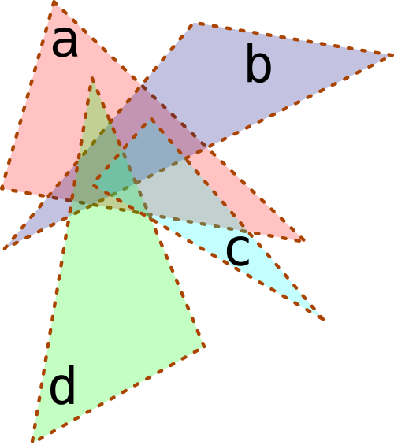

# Java 8: CompleteableFuture & CompleteableStage.

Após uma pausa um tanto longa tentarei escrever algo novamente.

Com a chegada do [Java 11](https://openjdk.java.net/projects/jdk/11/) e o [Java 12](https://openjdk.java.net/projects/jdk/12/) já no forno acho que é importante começarmos a utilizar algumas novidades da plataforma *Java* que foram lançados lá no [Java 8](https://openjdk.java.net/projects/jdk8/).

Particularmente gosto de imaginar um problema e depois apresentar uma forma de resolver. Para o artigo vamos imaginar o seguinte problema teórico: Imagine que você tem um problema que precisa ser resolvido em três estapas, as duas primeiras etapas são independentes e podem ser resolvidas paralelamente e a última etapa só pode ser resolvida aṕos as duas primeiras. Para exemplificar vamos imaginar o seguinte caso:

No exemplo temos quatro polígonos e calcularemos a interseção de **a** com **b**, a interseção de **c** com **d** e a união das duas interseções.

Como já deixei explícito na formulação do problema há duas etapas que podem e preferencialmente devem ser resolvidas paralelamente, a preferencia por uma solução paralela aqui não é apenas com o intuito de ganhar performance, também quero indicar uma vantagem do uso de programação funcional para a solução dos problemas de nossas aplicações.

## Modelando o problema

O primeiro passo sempre é imaginar como vamos implementar e o que utilizaremos para tal, no exemplo
